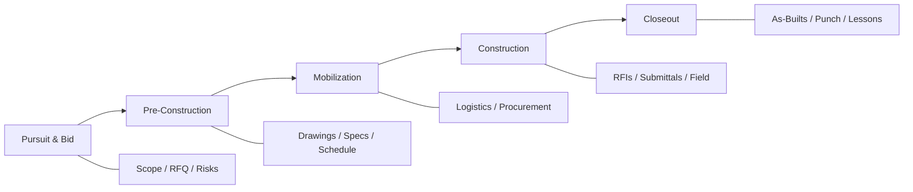

# Construction Artifacts by Project Phase

Artifacts work best when they produce **repeatable, structured outputs** that teams would otherwise rebuild manually from the same documents. For construction, the highest-value artifacts usually:

1. **Span a phase gate** — bid → award → mobilize → build → closeout
2. **Cross-reference sources** — a drawing sheet + spec section + meeting note should converge in one note
3. **Flag risk and gaps** — missing info, conflicts, ambiguities, long-lead items
4. **Feed the next artifact** — output of one becomes input context for the next

Construction OS already has a solid pre-construction foundation seeded in the product (Bid Scope, Takeoff, RFQ, etc.). This document maps a broader set of artifacts organized by **project lifecycle**, with emphasis on what a knowledge base rich in **drawings + specs + contracts + correspondence** can uniquely support.

**Legend:** ✅ = existing default artifact · 🆕 = proposed / not yet seeded

---

## Project lifecycle map



---

## Phase 1: Pursuit & bidding *(partially covered)*

| Artifact | What it extracts | Why it matters |
|----------|------------------|----------------|
| **Bid Scope Summary** ✅ *existing* | Trades, inclusions/exclusions, deliverables | Go/no-go and estimator handoff |
| **RFQ / RFP Requirements Extract** ✅ | Mandatory forms, bonding, deadlines | Avoid disqualification |
| **Cost & Pricing Risks** ✅ | Escalation, allowances, ambiguities | Contingency and margin |
| **Bid Clarification Log** 🆕 | Open questions, assumed clarifications, owner responses needed | Structured Q&A before numbers are final |
| **Competitor / Market Context Brief** 🆕 | Project size, delivery method, known competitors, labor market | Strategic bid positioning |
| **Allowance & Alternate Matrix** 🆕 | Base bid vs alternates, allowance buckets, owner options | Clean proposal structure |
| **Insurance & Bonding Summary** 🆕 | Limits, forms required, OCIP/CCIP, indemnity clauses | Legal/finance review before sign |

### Drawing-specific at bid stage

| Artifact | Output |
|----------|--------|
| **Drawing Set Index** 🆕 | Sheet list by discipline (A/S/M/E/P/C), revision dates, missing sheets |
| **Scope by Drawing Package** 🆕 | Which trades own which sheets/areas — helps subcontractor outreach |
| **Design Intent Summary** 🆕 | Narrative of what the building/system is — for exec summary in proposals |

---

## Phase 2: Pre-construction & design coordination

This is where a drawing-heavy knowledge base shines — and where there is the most room to differentiate from generic document AI.

| Artifact | What it extracts | Primary sources |
|----------|------------------|-----------------|
| **Quantity Takeoff Extract** ✅ | LF, SF, CY, EA with locations | Plans, details |
| **Schedule & Milestones** ✅ | Key dates, phases, constraints | Contract, schedule, specs |
| **Submittal / Spec Compliance** ✅ | Submittal register, testing, warranties | Div 01 + trade specs |
| **Spec Section Digest** 🆕 | Per CSI division: scope, products, execution, QA | Spec books |
| **Drawing–Spec Crosswalk** 🆕 | Where drawings reference spec sections; conflicts flagged | Drawings + specs |
| **Coordination Conflict Scan** 🆕 | Clashes/ambiguities between disciplines (e.g., ceiling height vs duct) | MEP + arch reflected ceiling |
| **Long-Lead Item Register** 🆕 | Equipment with lead times, approved manufacturers, early buy needs | Specs, schedules, equipment schedules |
| **Permit & Inspection Roadmap** 🆕 | Required permits, AHJ, special inspections, sign-off sequence | Specs, contract, drawings |
| **Value Engineering Opportunities** 🆕 | Spec over-specs, duplicate systems, constructability issues | Full drawing set |

### Architectural drawing specialists

| Artifact | Output |
|----------|--------|
| **Room / Area Program** 🆕 | Room name, number, area, finish level, occupancy |
| **Door & Window Schedule Extract** 🆕 | Mark, size, type, hardware group, fire rating |
| **Finish Schedule Extract** 🆕 | Floor/wall/ceiling/base by room |
| **Accessibility (ADA) Checklist** 🆕 | Clearances, ramp slopes, grab bars, signage obligations |
| **Life Safety / Egress Summary** 🆕 | Occupant load, exit paths, fire ratings, smoke compartments |
| **Structural Notes Digest** 🆕 | Design loads, special inspections, embed requirements |
| **Site & Civil Summary** 🆕 | Grading, utilities, stormwater, easements, temp facilities |

---

## Phase 3: Mobilization & procurement

| Artifact | What it extracts | Why it matters |
|----------|------------------|----------------|
| **Subcontractor Scope Letter Draft** 🆕 | Trade-specific scope, exclusions, allowances, drawing refs | Faster buyout |
| **Site Logistics Plan Brief** 🆕 | Crane zones, staging, access, laydown, traffic | Field readiness |
| **Procurement Tracker Seed** 🆕 | Item, spec section, required-by date, submittal dependency | Links schedule to buying |
| **Preconstruction Meeting Brief** 🆕 | Attendees, decisions needed, open RFIs, baseline schedule | Kickoff alignment |
| **Baseline Schedule Narrative** 🆕 | Critical path story in plain language — not just dates | Owner/GC communication |

---

## Phase 4: Construction execution

Where daily project management lives — high frequency, high ROI.

| Artifact | What it extracts | Primary sources |
|----------|------------------|-----------------|
| **Change-Order Impact** ✅ | Scope, cost, schedule, negotiation notes | CO docs, drawings, emails |
| **Safety & Code Checklist** ✅ | PPE, permits, hazmat, environmental | Specs, site plans, OSHA refs |
| **RFI Draft / Register Entry** 🆕 | Question, affected sheets/specs, proposed resolution | Drawings, specs, photos |
| **Submittal Review Summary** 🆕 | Product vs spec compliance, deviations, action required | Submittals + spec |
| **Daily Report Digest** 🆕 | Weather, crew, work completed, delays, visitors | Field notes, photos |
| **Punch List Item Extract** 🆕 | Location, trade, deficiency, priority | Walkthrough notes, photos |
| **Progress vs Schedule Snapshot** 🆕 | What was planned vs observed this period | Schedule + daily logs |
| **Meeting Minutes (Construction)** 🆕 | Decisions, action items, responsible party, due date | OAC/weekly meeting transcripts |
| **Delay & Claim Evidence Pack** 🆕 | Event, cause, notice requirements, supporting docs | Correspondence, logs, weather |
| **Quality Control Checklist** 🆕 | Hold points, testing frequency, responsible inspector | Spec QA sections |

### Drawing-aware field artifacts

| Artifact | Output |
|----------|--------|
| **Revision Delta Summary** 🆕 | What changed between drawing revisions — impact by trade |
| **As-Built Markup Guide** 🆕 | Sheets requiring field redlines, systems to capture |
| **Installation Sequence by Area** 🆕 | Rough-in → close-in order for a zone/floor |

---

## Phase 5: Closeout & handoff

Often neglected until the end — artifacts here prevent warranty chaos.

| Artifact | What it extracts |
|----------|------------------|
| **Closeout Document Checklist** 🆕 | O&M manuals, warranties, training, spare parts, as-builts |
| **O&M Manual Index** 🆕 | Equipment list, manual status, missing items |
| **Warranty Register** 🆕 | System, duration, start trigger, contact |
| **Training & Turnover Brief** 🆕 | Owner training requirements, who delivers what |
| **Final Punch by Trade** 🆕 | Open items grouped for subcontractor closeout |
| **Lessons Learned Report** 🆕 | What went well, overruns, RFIs that repeated, drawing gaps |
| **Project Executive Summary** 🆕 | One-page handoff for leadership / future bids |

---

## Cross-cutting “super artifacts” (multi-source)

These are especially powerful when run against **the whole project knowledge base**, not one PDF:

| Artifact | Purpose |
|----------|---------|
| **Project Risk Register** | Consolidates cost, schedule, safety, design, contractual risks with severity |
| **Open Items Dashboard** | All unresolved RFIs, submittals, COs, punch, permits in one structured note |
| **Trade Responsibility Matrix** | Who owns what across drawings, specs, and contract |
| **Document Conflict Report** | Drawing says X, spec says Y — with citations |
| **Owner / GC Communication Log** | Decisions and commitments extracted from email chains |
| **Constructability Review** | Sequencing, access, crane, temp power, phasing issues before mobilization |

> **Note:** Today artifacts run **per source**; these multi-source artifacts may be better as **Ask** workflows or a future “project-level artifact” feature — worth calling out in product planning.

---

## Recommended priority tiers

### Tier 1 — Ship next (highest ROI, fits current artifact model)

These complement the existing eight defaults and leverage drawings directly:

1. **Drawing Set Index** — immediate value when KB has plan sets
2. **Spec Section Digest** — pairs with Submittal Compliance
3. **RFI Draft / Register Entry** — daily PM workflow
4. **Meeting Minutes (Construction)** — OAC/weekly meetings
5. **Long-Lead Item Register** — schedule + procurement bridge
6. **Revision Delta Summary** — every drawing update triggers this
7. **Closeout Document Checklist** — end-to-end lifecycle completeness

### Tier 2 — Differentiators (drawing-native)

8. **Room / Area Program**
9. **Door & Window Schedule Extract**
10. **Finish Schedule Extract**
11. **Drawing–Spec Crosswalk**
12. **Coordination Conflict Scan**

### Tier 3 — Advanced / may need project-level context

13. **Project Risk Register**
14. **Document Conflict Report**
15. **Open Items Dashboard**
16. **Constructability Review**

---

## Suggested artifact bundles by role

| Role | Starter pack |
|------|----------------|
| **Estimator** | Bid Scope, Takeoff, Cost Risks, Allowance Matrix, Drawing Index |
| **Project Manager** | Schedule, RFIs, Meeting Minutes, Change-Order Impact, Open Items |
| **Superintendent** | Safety Checklist, Daily Report Digest, Installation Sequence, Punch List |
| **Project Engineer** | Submittal Compliance, Spec Digest, Drawing–Spec Crosswalk, Revision Delta |
| **Precon Manager** | Long-Lead Register, Sub Scope Letters, Permit Roadmap, Logistics Brief |
| **Closeout Manager** | Closeout Checklist, O&M Index, Warranty Register, Lessons Learned |

---

## Example prompt shape (Tier 1: Drawing Set Index)

Illustrates construction-specific structure for a Tier 1 artifact:

```
From this drawing set or sheet, produce:

**Project**: Name, address, project number
**Issue Date / Revision**: Current revision and prior if noted
**Sheet Index** (table):
| Discipline | Sheet # | Title | Revision | Notes |
**Missing / Referenced but Absent**: Sheets called out but not in set
**Key Details Sheets**: Sections, details, schedules worth estimator/PM review
**Assumptions & Gaps**: Information not shown that affects scope

Cite sheet numbers for every row. Flag items needing RFI.
```

---

## Gaps in current defaults vs. full lifecycle

| Phase | Coverage today | Gap |
|-------|----------------|-----|
| Pursuit/Bid | Strong (4 artifacts) | Clarifications, alternates, bonding detail |
| Precon/Coordination | Moderate (takeoff, submittals, schedule) | Drawing indexes, spec digests, conflict scans |
| Mobilization | Weak | Logistics, procurement, scope letters |
| Field execution | Weak (CO, safety only) | RFIs, dailies, punch, meetings, revisions |
| Closeout | None | O&M, warranties, lessons learned |

---

## Product considerations

1. **Batch by document type** — run Drawing Index across all A-series sheets; Spec Digest across all Div 09 PDFs.
2. **Phase-aware UI** — group artifacts under Pursuit / Precon / Build / Closeout in the Artifacts page.
3. **Output → action** — structured fields (owner, due date, trade) so notes can feed trackers later.
4. **Multi-source artifacts** — Project Risk Register and Conflict Report likely need Ask or a project-scoped run, not single-source only.
5. **Vision on drawings** — takeoff and schedule extracts improve significantly if drawing ingestion preserves sheet metadata and scale.

---

## Summary recommendation

Keep the existing eight defaults as the **Pursuit & Precon core**, then expand in this order:

1. **Drawing intelligence** (index, schedules, revision deltas) — unique moat
2. **Field execution** (RFI, meetings, punch, dailies) — daily stickiness
3. **Closeout** (checklists, O&M, lessons learned) — completes “start to finish”
4. **Project-level synthesis** (risk register, conflict report) — likely a v2 capability

A sensible next step for implementation is picking **5–7 Tier 1 artifacts**, writing full prompt templates (like the seeded ones in `rebrand_migration.py`), and grouping them in the Artifacts UI by project phase.
