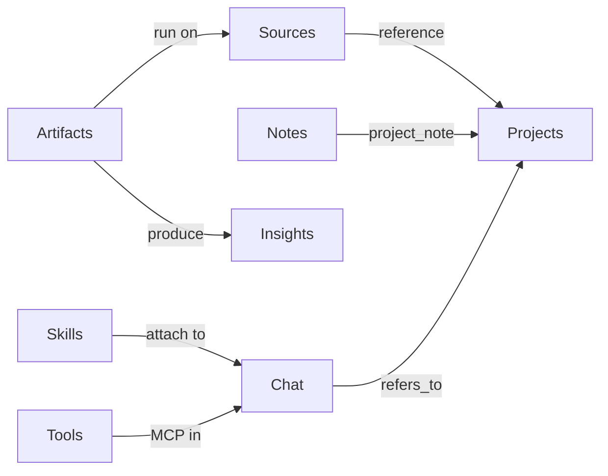

# Construction OS Rebrand — Complete Checklist

**Date:** 2026-07-10
**Goal:** Fully rebrand the application from **Open Notebook** to **Construction OS** and rename every domain concept across the entire stack. Nothing is skipped or deferred — this document is the complete task list from A to Z.

**Last updated:** 2026-07-10 — Final comprehensive audit complete; automated verification re-confirmed (17.1–17.2, 17.8–17.14); manual UI E2E (17.3–17.7) pending.

When every box in this file is checked, the rebrand is done.

---

## How to use this document

1. Work top to bottom. Phases are ordered so earlier work unblocks later work.
2. Check each box `[x]` only after the change is made **and** verified.
3. Never edit historical SurrealDB migrations (1–19). Always add new migrations.
4. After each phase, run its **Verify** step before moving on.
5. Keep the [Progress summary](#progress-summary) table in sync.

---

## Final naming (target end state)

Every name below must exist in the finished product. The left column fully replaces the right column everywhere.

| Construction OS (new) | Open Notebook (old) | Layers affected |
|-----------------------|---------------------|-----------------|
| Construction OS | Open Notebook | Brand, UI, docs, metadata |
| `construction_os` | `open_notebook` | Python package, imports |
| `construction_os` | `open_notebook` | Surreal namespace + database |
| `construction_os:*` | `open_notebook:*` | Singleton record IDs |
| `CONSTRUCTION_OS_*` | `OPEN_NOTEBOOK_*` | Environment variables |
| `construction-os` | `open-notebook` / `lfnovo/open_notebook` | Docker image / service |
| `ConstructionOSError` | `OpenNotebookError` | Exception base class |
| **Project** (`project`) | Notebook (`notebook`) | DB table, IDs, API, UI, i18n |
| **Artifact** (`artifact`) | Transformation (`transformation`) | DB table, IDs, API, UI, i18n |
| `project_note` relation | `artifact` relation (note→notebook) | DB relation (renamed to free up "artifact") |
| `reference` → project | `reference` → notebook | DB relation retarget |
| `refers_to` → project\|source | `refers_to` → notebook\|source | DB relation retarget |
| Skills | Skills | Copy only (already named well) |
| Tools | Tools (MCP) | Copy only |
| Sources / Notes / Insights | Same | Copy only (construction-aware wording) |

### Critical ordering rule (read before Phase 1)

The DB already has a relation named **`artifact`** (`note` → `notebook`). We are renaming **Transformations → Artifacts**. To avoid a collision:

1. First rename the existing note↔notebook relation `artifact` → **`project_note`**.
2. Only then rename the `transformation` table → **`artifact`**.

Do these in the migration order specified in Phases 1 and 2 below.

---

## Progress summary

| Phase | Focus | Status |
|-------|--------|--------|
| 0 | Naming locked (this section) | Done |
| 1 | DB migration 20 — Notebook → Project | Done |
| 2 | DB migration 21 — Transformation → Artifact | Done |
| 3 | DB migration 22 — Construction default Artifacts | Done |
| 4 | Migration registration + namespace/singletons | Done |
| 5 | Python package rename `open_notebook` → `construction_os` | Done |
| 6 | Domain models (Project, Artifact) | Done |
| 7 | API routers / services / models | Done |
| 8 | Commands & graphs | Done |
| 9 | Frontend routes & redirects | Done |
| 10 | Frontend lib (api/hooks/stores/types) | Done |
| 11 | Frontend components | Done |
| 12 | i18n (14 locales) | Done |
| 13 | Branding assets & metadata | Done |
| 14 | Environment / Docker / infra | Done |
| 15 | Tests | Done |
| 16 | Docs / README / CLAUDE | Done |
| 17 | Full end-to-end verification | Automated done; manual E2E pending |

---

## Phase 1 — Database migration 20: Notebook → Project

Create `construction_os/database/migrations/20.surrealql` (and `20_down.surrealql`). Data copy runs via `construction_os/database/rebrand_migration.py` on API startup.

- [x] 1.1 Define `project` table with the same fields as `notebook` (`name`, `description`, `archived`, `created`, `updated`)
- [x] 1.2 Copy all rows: `notebook` → `project` (preserve `created`/`updated`) — `rebrand_migration.py`
- [x] 1.3 Build an old→new ID map (`notebook:x` → `project:y`) in a temp table or via a Python migration helper
- [x] 1.4 Rename note↔notebook relation **`artifact` → `project_note`**, retargeting `note` → `project`
- [x] 1.5 Retarget `reference` relation `source` → `project` using the ID map
- [x] 1.6 Retarget `refers_to` relation and redefine as `FROM chat_session TO project|source`
- [x] 1.7 Rewrite any stored `notebook:*` ID strings inside JSON/metadata fields (chat context configs, podcast episode metadata)
- [x] 1.8 Drop the `notebook` table, the old `artifact` relation, and the temp map table
- [x] 1.9 Write `20_down.surrealql` reversing the above (document that production rollback requires a backup)
- [x] **Verify:** on a copy of a populated DB, all sources/notes/chats remain linked to `project:*` records

---

## Phase 2 — Database migration 21: Transformation → Artifact

Create `construction_os/database/migrations/21.surrealql` (and `21_down.surrealql`). Runs **after** Phase 1 so `project_note` already freed the `artifact` name.

- [x] 2.1 Define `artifact` table with the same fields as `transformation` (`name`, `title`, `description`, `prompt`, `apply_default`, `created`, `updated`)
- [x] 2.2 Copy all rows: `transformation` → `artifact` — `rebrand_migration.py`
- [x] 2.3 Rename singleton `open_notebook:default_prompts` field `transformation_instructions` → `artifact_instructions` (migrate value)
- [x] 2.4 Update `source_insight.insight_type` references if they embed the word "transformation" (data-level; usually just titles — safe; no ID refs found, titles preserved)
- [x] 2.5 Drop the `transformation` table
- [x] 2.6 Write `21_down.surrealql` reversing the rename
- [x] **Verify:** existing insights still resolve; artifact list loads post-migration

---

## Phase 3 — Database migration 22: Construction default Artifacts

Create `construction_os/database/migrations/22.surrealql` (and `22_down.surrealql`). Seed construction-industry Artifacts and a construction-tuned default instruction prompt.

- [x] 3.1 Set `construction_os:default_prompts.artifact_instructions` to a construction-focused system instruction
- [x] 3.2 Insert construction Artifact templates (each: `name`, `title`, `description`, `prompt`, `apply_default`):
  - [x] Bid Scope Summary
  - [x] Quantity Takeoff Extract
  - [x] Cost & Pricing Risks
  - [x] Schedule & Milestones
  - [x] RFQ / RFP Requirements Extract
  - [x] Submittal / Spec Compliance
  - [x] Change-Order Impact
  - [x] Safety & Code Checklist
- [x] 3.3 Write `22_down.surrealql` deleting the seeded Artifacts
- [x] **Verify:** new install shows construction Artifacts; existing custom Artifacts untouched

---

## Phase 4 — Migration registration, namespace & singletons

- [x] 4.1 Register migrations 20, 21, 22 (up and down) in `construction_os/database/async_migrate.py`
- [x] 4.2 Update `AsyncMigrationManager` count/docstring to reflect new total
- [x] 4.3 Rename Surreal namespace & database `open_notebook` → `construction_os` in `construction_os/database/repository.py` defaults (and env references)
- [x] 4.4 Rename all singleton record IDs `open_notebook:*` → `construction_os:*`:
  - [x] `construction_os:default_models` (`construction_os/ai/models.py`)
  - [x] `construction_os:default_prompts` (`construction_os/domain/artifact.py`)
  - [x] `construction_os:provider_configs` (`construction_os/domain/provider_config.py`)
  - [x] `construction_os:content_settings` (`construction_os/domain/content_settings.py`)
  - [x] Any others found via search for `open_notebook:`
- [x] 4.5 Add a migration or startup step to migrate existing singleton records to the new IDs (copy then delete old) — `rebrand_migration.py`
- [x] 4.6 Update `construction_os/database/CLAUDE.md`
- [x] **Verify:** app boots against `construction_os` namespace; settings/models/credentials load

---

## Phase 5 — Python package rename `open_notebook` → `construction_os`

This touches nearly every backend import. Do it as one mechanical pass, then fix stragglers.

- [x] 5.1 Rename the directory `open_notebook/` → `construction_os/`
- [x] 5.2 Update every `from open_notebook...` / `import open_notebook...` → `construction_os` across `api/`, `commands/`, `tests/`, `scripts/`, `run_api.py`
- [x] 5.3 Update `pyproject.toml` (package name, packages, scripts, entry points)
- [x] 5.4 Update `uv.lock` via dependency tooling (regenerate, don't hand-edit)
- [x] 5.5 Update `mypy.ini`, any `setup`/config referencing the package path
- [x] 5.6 Update migration file path strings in `construction_os/database/async_migrate.py`
- [x] 5.7 Rename exception base `OpenNotebookError` → `ConstructionOSError` in `construction_os/exceptions.py` and all references
- [x] 5.8 Update `commands/*.py` `app="open_notebook"` → `app="construction_os"` (surreal-commands app id)
- [x] **Verify:** `uv run python -c "import construction_os"` works; `uv run pytest -q` green

---

## Phase 6 — Domain models

### Project (was Notebook)

- [x] 6.1 Rename `construction_os/domain/notebook.py` → `domain/project.py`
- [x] 6.2 Class `Notebook` → `Project`, `table_name = "project"`
- [x] 6.3 Queries `artifact` → `project_note`; keep `reference`, `refers_to` names but expect `project` targets
- [x] 6.4 Methods: `add_to_notebook()` → `add_to_project()`, `get_notebook*` → `get_project*`, error strings → "Project…"
- [x] 6.5 `domain/base.py` — polymorphic `ObjectModel.get()` resolves `project:` and `artifact:` prefixes
- [x] 6.6 `domain/__init__.py` — exports + docstring

### Artifact (was Transformation)

- [x] 6.7 Rename `construction_os/domain/transformation.py` → `domain/artifact.py`
- [x] 6.8 Class `Transformation` → `Artifact`, `table_name = "artifact"`
- [x] 6.9 `DefaultPrompts.transformation_instructions` → `artifact_instructions`

### Consumers

- [x] 6.10 `construction_os/utils/context_builder.py` — `notebook_id` → `project_id`, builder names
- [x] 6.11 `prompts/chat/system.jinja` — `` → ``
- [x] 6.12 Update domain-facing CLAUDE docs (`domain/CLAUDE.md`, `utils/CLAUDE.md`)
- [x] **Verify:** `uv run pytest tests/test_domain.py`

---

## Phase 7 — API (routers / services / models)

### Projects API (was notebooks)

- [x] 7.1 `api/routers/notebooks.py` → `api/routers/projects.py` (paths `/notebooks` → `/projects`, SurrealQL `notebook`→`project`, counts via `project_note`)
- [x] 7.2 `api/notebook_service.py` → `api/project_service.py`
- [x] 7.3 `api/models.py` — `Notebook*` schemas → `Project*`, `notebook_id`→`project_id`, `notebooks`→`projects`
- [x] 7.4 `api/client.py` — notebook client methods → project
- [x] 7.5 `api/main.py` — register `projects` router, tag "Projects", title "Construction OS API"

### Artifacts API (was transformations)

- [x] 7.6 `api/routers/transformations.py` → `api/routers/artifacts.py` (paths `/transformations` → `/artifacts`)
- [x] 7.7 `api/transformations_service.py` → `api/artifacts_service.py`
- [x] 7.8 `api/models.py` — `Transformation*` → `Artifact*`
- [x] 7.9 `api/client.py` — transformation methods → artifact
- [x] 7.10 `api/main.py` — register `artifacts` router, tag "Artifacts"
- [x] 7.11 Model config key `default_transformation_model` → `default_artifact_model` (`api/models.py`, `construction_os/ai/models.py`)

### Cross-cutting routers/services (notebook_id → project_id, transformation → artifact)

- [x] 7.12 `api/routers/sources.py`
- [x] 7.13 `api/routers/notes.py`
- [x] 7.14 `api/routers/chat.py`
- [x] 7.15 `api/routers/source_chat.py`
- [x] 7.16 `api/routers/context.py` (`/notebooks/{id}/context` → `/projects/{id}/context`)
- [x] 7.17 `api/routers/insights.py`
- [x] 7.18 `api/routers/podcasts.py`
- [x] 7.19 `api/routers/search.py`
- [x] 7.20 `api/routers/auth.py` (brand strings)
- [x] 7.21 `api/chat_service.py`, `api/context_service.py`, `api/sources_service.py`, `api/notes_service.py`, `api/podcast_service.py`, `api/insights_service.py`
- [x] 7.22 `api/ag_ui_agents.py` — `notebook_chat_agent` → `project_chat_agent`
- [x] 7.23 `api/CLAUDE.md`
- [x] **Verify:** `/docs` shows Projects + Artifacts; CRUD works for both; source attach/detach, chat, insights, podcasts function

---

## Phase 8 — Commands & graphs

- [x] 8.1 `commands/source_commands.py` — `notebook_ids` → `project_ids`, `run_transformation` → `run_artifact`, logging
- [x] 8.2 `commands/embedding_commands.py` — imports + `create_insight` transformation refs
- [x] 8.3 `commands/CLAUDE.md`, `commands/__init__.py`
- [x] 8.4 `construction_os/graphs/transformation.py` → `graphs/artifact.py` (state, `transformation_graph` → `artifact_graph`)
- [x] 8.5 `construction_os/graphs/chat.py` — notebook context → project, `_format_notebook_context` → project
- [x] 8.6 `construction_os/graphs/source.py` — `notebook_ids` → `project_ids`; transformation fan-out → artifact
- [x] 8.7 `construction_os/graphs/source_chat.py`, `graphs/ask.py`, `graphs/prompt.py`, `graphs/checkpointer.py`
- [x] 8.8 `construction_os/graphs/CLAUDE.md`
- [x] **Verify:** `uv run pytest tests/test_graphs.py`; run an artifact end-to-end produces an insight

---

## Phase 9 — Frontend routes & redirects

### Projects route tree (move `notebooks/` → `projects/`)

- [x] 9.1 `frontend/src/app/(dashboard)/notebooks/page.tsx` → `projects/page.tsx`
- [x] 9.2 `.../notebooks/loading.tsx`
- [x] 9.3 `.../notebooks/[id]/page.tsx`
- [x] 9.4 `.../notebooks/[id]/loading.tsx`
- [x] 9.5 `.../notebooks/components/NotebookList.tsx` → `ProjectList.tsx`
- [x] 9.6 `.../NotebookRow.tsx` → `ProjectRow.tsx`
- [x] 9.7 `.../NotebookCard.tsx` → `ProjectCard.tsx`
- [x] 9.8 `.../NotebookHeader.tsx` → `ProjectHeader.tsx`
- [x] 9.9 `.../NotebookDeleteDialog.tsx` → `ProjectDeleteDialog.tsx`
- [x] 9.10 `.../SourcesColumn.tsx`, `NotesColumn.tsx`, `ChatColumn.tsx`, `ChatColumn.test.tsx`, `NoteEditorDialog.tsx`

### Artifacts route tree (move `transformations/` → `artifacts/`)

- [x] 9.11 `frontend/src/app/(dashboard)/transformations/page.tsx` → `artifacts/page.tsx`
- [x] 9.12 `.../transformations/loading.tsx`
- [x] 9.13 `.../components/TransformationsList.tsx` → `ArtifactsList.tsx`
- [x] 9.14 `TransformationCard.tsx` → `ArtifactCard.tsx`
- [x] 9.15 `TransformationEditorDialog.tsx` → `ArtifactEditorDialog.tsx`
- [x] 9.16 `TransformationPlayground.tsx` → `ArtifactPlayground.tsx`
- [x] 9.17 `DefaultPromptEditor.tsx`

### Entry redirects

- [x] 9.18 `frontend/src/proxy.ts` — `/` → `/projects`
- [x] 9.19 `frontend/src/app/page.tsx` and `(dashboard)/page.tsx`
- [x] 9.20 `frontend/src/components/auth/LoginForm.tsx` — post-login `/projects`
- [x] 9.21 Add redirects `/notebooks(/*)` → `/projects$1` and `/transformations(/*)` → `/artifacts$1`
- [x] 9.22 `frontend/src/app/(dashboard)/search/page.tsx`, `advanced/components/RebuildEmbeddings.tsx`, `settings/api-keys/page.tsx`
- [x] 9.23 `frontend/src/CLAUDE.md`
- [x] **Verify:** navigation works; old URLs redirect

---

## Phase 10 — Frontend lib (api / hooks / stores / types)

### API modules

- [x] 10.1 `lib/api/notebooks.ts` → `projects.ts` (`/api/projects`)
- [x] 10.2 `lib/api/transformations.ts` → `artifacts.ts` (`/api/artifacts`)
- [x] 10.3 `lib/api/query-client.ts` — `QUERY_KEYS.notebooks`→`projects`, transformations→artifacts
- [x] 10.4 `lib/api/chat.ts`, `lib/api/sources.ts`, `lib/api/notes.ts`, `lib/api/insights.ts`
- [x] 10.5 `lib/api/client.ts` (transformation refs), `lib/api/CLAUDE.md`

### Hooks

- [x] 10.6 `lib/hooks/use-notebooks.ts` → `use-projects.ts`
- [x] 10.7 `lib/hooks/useNotebookChat.ts` → `useProjectChat.ts`
- [x] 10.8 `lib/hooks/use-transformations.ts` → `use-artifacts.ts`
- [x] 10.9 `lib/hooks/use-notes.ts`, `use-sources.ts`
- [x] 10.10 `lib/hooks/use-create-dialogs.tsx` — `openNotebookDialog` → `openProjectDialog`
- [x] 10.11 `lib/hooks/use-route-prefetch.ts`, `use-auth.ts` (probe `/api/projects`), `use-version-check.ts`
- [x] 10.12 `lib/hooks/CLAUDE.md`

### Stores

- [x] 10.13 `lib/stores/notebook-view-store.ts` → `project-view-store.ts`
- [x] 10.14 `lib/stores/notebook-columns-store.ts` → `project-columns-store.ts`
- [x] 10.15 `lib/stores/auth-store.ts`, `lib/stores/CLAUDE.md`

### Types & utils

- [x] 10.16 `lib/types/api.ts` — `NotebookResponse`→`ProjectResponse`, `Transformation*`→`Artifact*`, `notebook_id`→`project_id`
- [x] 10.17 `lib/types/notebook-context.ts` → `project-context.ts`
- [x] 10.18 `lib/types/transformations.ts` → `artifacts.ts`
- [x] 10.19 `lib/types/podcasts.ts` — `notebook_id`
- [x] 10.20 `lib/types/models.ts` — `default_transformation_model` → `default_artifact_model`
- [x] 10.21 `lib/utils/note-query-cache.ts`, `source-query-cache.ts`, `source-context.ts`
- [x] 10.22 `lib/utils/error-handler.ts` — "Notebook not found"/"Transformation not found" → project/artifact keys
- [x] 10.23 `frontend/scripts/measure-runtime-vitals.mjs` — routes + brand comment
- [x] **Verify:** `npm run build` (or typecheck) passes

---

## Phase 11 — Frontend components

### Renames

- [x] 11.1 `components/notebooks/CreateNotebookDialog.tsx` → `components/projects/CreateProjectDialog.tsx`
- [x] 11.2 `components/notebooks/ColumnHeader.tsx`, `CollapsibleColumn.tsx` → under `components/projects/`
- [x] 11.3 `components/sources/steps/NotebooksStep.tsx` → `ProjectsStep.tsx`
- [x] 11.4 `components/source/NotebookAssociations.tsx` → `ProjectAssociations.tsx`
- [x] 11.5 `components/search/SaveToNotebooksDialog.tsx` → `SaveToProjectsDialog.tsx`

### Content / import updates

- [x] 11.6 `components/layout/AppSidebar.tsx` — nav hrefs `/projects` + `/artifacts`, create target `project`, logo alt, icons
- [x] 11.7 `components/layout/AppSidebar.test.tsx`
- [x] 11.8 `components/common/CommandPalette.tsx` — nav items + keywords (projects, artifacts, estimation, takeoff)
- [x] 11.9 `components/common/ContextToggle.tsx`
- [x] 11.10 `components/source/ChatPanel.tsx`, `ChatMessageList.tsx`, `ChatMessageRow.tsx`, `MessageActions.tsx`, `SourceDetailContent.tsx`, `ModelSelector.tsx`
- [x] 11.11 `components/sources/AddSourceDialog.tsx`, `AddExistingSourceDialog.tsx`, `SourceCard.tsx`, `steps/SourceTypeStep.tsx`, `steps/ProcessingStep.tsx`
- [x] 11.12 `components/podcasts/GeneratePodcastDialog.tsx`
- [x] 11.13 `components/providers/ModalProvider.tsx` — `notebookId` → `projectId`
- [x] 11.14 `components/layout/DashboardContentSkeleton.tsx`, `AppShellSkeleton.tsx`
- [x] 11.15 `components/errors/ConnectionErrorOverlay.tsx`, `components/layout/SetupBanner.tsx` (brand/links)
- [x] **Verify:** create project → add source → run artifact → chat all render

---

## Phase 12 — i18n (all 14 locales)

Do `en-US` first as canonical, then mirror to every other locale.

### Locale files

- [x] 12.1 `en-US` — canonical pass
- [x] 12.2 `es-ES`
- [x] 12.3 `pt-BR`
- [x] 12.4 `fr-FR`
- [x] 12.5 `de-DE`
- [x] 12.6 `it-IT`
- [x] 12.7 `ja-JP`
- [x] 12.8 `zh-CN`
- [x] 12.9 `zh-TW`
- [x] 12.10 `ru-RU`
- [x] 12.11 `pl-PL`
- [x] 12.12 `ca-ES`
- [x] 12.13 `tr-TR`
- [x] 12.14 `bn-IN`
- [x] 12.15 `lib/locales/CLAUDE.md`

### Keys to change in every locale

- [x] 12.16 `common.appName` → "Construction OS"; `auth.loginTitle` → "Construction OS"
- [x] 12.17 Remaining "Construction OS" strings (`apiDesc`, `docLink`, `filesHelp`, `updateAvailableDesc`, model/settings copy)
- [x] 12.18 `navigation.notebooks` → "Projects"; `navigation.transformations`/`transformation` → "Artifacts"/"Artifact"
- [x] 12.19 Rename section `notebooks.*` → `projects.*` (title, new, search, delete preview, archive, CRUD toasts, chat/source/note keys)
- [x] 12.20 Rename section `transformations.*` → `artifacts.*` (title, desc, playground, default prompt, toasts)
- [x] 12.21 `common.newNotebook`/`notebook`/`notebookLabel` → project; `common.editTransformation` → editArtifact
- [x] 12.22 `commandPalette.searchNotebooks` → searchProjects
- [x] 12.23 `apiErrors.notebookNotFound` → projectNotFound; `apiErrors.transformationNotFound` → artifactNotFound
- [x] 12.24 `sources.manageNotebooks*` → manageProjects; `sources.selectTransformation` → selectArtifact; batch settings copy
- [x] 12.25 `search.saveToNotebooks*` → saveToProjects
- [x] 12.26 `podcasts.loadingNotebooks`/`noNotebooksFound*` → projects
- [x] 12.27 `models.transformationModelLabel`/`Desc` → artifact model; `models.defaultAssignmentsDesc`, `missingRequiredModels`
- [x] 12.28 Update **every** `t('notebooks.*')` and `t('transformations.*')` call site in the frontend to the new namespaces
- [x] 12.29 `scripts/inject_tools_i18n.py` — update regex/section names
- [x] **Verify:** app loads all locales with no missing-key warnings (spot-check en-US + one more)

---

## Phase 13 — Branding assets & metadata

- [x] 13.1 `frontend/src/app/layout.tsx` — `metadata.title` → "Construction OS", construction-focused description
- [x] 13.2 `frontend/public/logo.svg` — replace with Construction OS mark/wordmark
- [x] 13.3 `frontend/src/components/layout/AppSidebar.tsx` — product name + logo alt text
- [x] 13.4 Favicon / any app icons referencing the old brand
- [x] **Verify:** browser tab title, sidebar, and login all show Construction OS

---

## Phase 14 — Environment / Docker / infra

- [x] 14.1 Rename env vars `OPEN_NOTEBOOK_*` → `CONSTRUCTION_OS_*` in code readers and `.env.example`
  - [x] `OPEN_NOTEBOOK_ENCRYPTION_KEY` → `CONSTRUCTION_OS_ENCRYPTION_KEY` (document that the key **value** must be preserved to decrypt existing credentials)
- [x] 14.2 Update `construction_os/utils/encryption.py` and any `os.environ`/`getenv` lookups
- [x] 14.3 `SURREAL_NAMESPACE` / `SURREAL_DATABASE` defaults → `construction_os` (`.env.example`, compose files, docs)
- [x] 14.4 `Dockerfile`, `Dockerfile.single` — package paths, labels, image metadata
- [x] 14.5 `docker-compose.yml` and `examples/docker-compose-*.yml` — service names, image tags `construction-os`, volume names
- [x] 14.6 `Makefile`, `run_api.py`, `dev-init.sh` — package/module paths, image names
- [x] 14.7 `examples/easypanel/*` (meta.yaml, index.ts, README), `examples/README.md`
- [x] 14.8 `.github/workflows/*.yml` — path filters (`notebooks/**`→`projects/**`), image names, build steps
- [x] 14.9 `.github/ISSUE_TEMPLATE/*`, `pull_request_template.md` (brand)
- [x] **Verify:** `docker compose build` succeeds; container boots with new env var names

---

## Phase 15 — Tests

### Backend

- [x] 15.1 `tests/conftest.py` — fixtures, package imports, `project`/`artifact` tables
- [x] 15.2 `tests/test_domain.py` — `Project`, `Artifact`, `project:*`/`artifact:*` IDs
- [x] 15.3 `tests/test_graphs.py`
- [x] 15.4 `tests/test_sources_api.py` — `reference` relation, project associations
- [x] 15.5 `tests/test_notes_api.py`
- [x] 15.6 `tests/test_search_api.py`
- [x] 15.7 `tests/test_crud_404.py`
- [x] 15.8 `tests/test_models_api.py` — `default_artifact_model`
- [x] 15.9 `tests/test_utils.py`, `test_chunking.py`, `test_embedding.py`, `test_embedding_commands.py`
- [x] 15.10 `tests/test_credentials_api.py`, `test_skills_standard.py`
- [x] 15.11 `tests/test_mcp_*.py` — package imports
- [x] 15.12 Add tests for migrations 20/21/22 (notebook→project, transformation→artifact, seeds)

### Frontend

- [x] 15.13 `.../projects/components/ChatColumn.test.tsx`
- [x] 15.14 `components/layout/AppSidebar.test.tsx`
- [x] 15.15 `lib/hooks/use-translation.test.ts` — `appName` = "Construction OS"
- [x] 15.16 `frontend/src/test/setup.ts` — routes/endpoints
- [x] **Verify:** `uv run pytest tests/` green; frontend build passes (`npm run build`)

---

## Phase 16 — Docs / README / CLAUDE

### Root

- [x] 16.1 `README.md` — Construction OS overview; Projects / Artifacts / Skills / Tools; construction use case; fix broken links
- [x] 16.2 `README.dev.md`
- [x] 16.3 `CLAUDE.md` (root) — architecture with Project/Artifact terminology, package `construction_os`
- [x] 16.4 `CONTRIBUTING.md`, `SECURITY.md`, `CODE_OF_CONDUCT.md`, `CHANGELOG.md` (add rebrand entry)
- [x] 16.5 `CONFIGURATION.md` / `MAINTAINER_GUIDE.md` if present

### docs/ tree (brand + concept rename)

- [x] 16.6 `docs/index.md`
- [x] 16.7 `docs/0-START-HERE/*`
- [x] 16.8 `docs/1-INSTALLATION/*`
- [x] 16.9 `docs/2-CORE-CONCEPTS/*` — rename `notebooks-sources-notes.md` → `projects-sources-notes.md`; `chat-vs-transformations.md` → `chat-vs-artifacts.md`; update links
- [x] 16.10 `docs/3-USER-GUIDE/*` — rename `transformations.md` → `artifacts.md`; update all guides
- [x] 16.11 `docs/4-AI-PROVIDERS/*`
- [x] 16.12 `docs/5-CONFIGURATION/*` — env var names, namespace, `/api/projects` + `/api/artifacts`
- [x] 16.13 `docs/6-TROUBLESHOOTING/*`
- [x] 16.14 `docs/7-DEVELOPMENT/*` — `api-reference.md`, `architecture.md`, setup, standards
- [x] 16.15 Package CLAUDE files: `construction_os/CLAUDE.md`, `ai/CLAUDE.md`, `graphs/CLAUDE.md`, `podcasts/CLAUDE.md`, `commands/CLAUDE.md`, `prompts/CLAUDE.md`
- [x] **Verify:** grep the repo for `Construction OS` / `Construction OS` / `construction_os` / `notebook` / `transformation` and confirm only intended historical references remain

---

## Phase 17 — Full end-to-end verification

Run the whole flow on a clean environment and on an upgraded (previously populated) database.

- [x] 17.1 Migrations 20–22 apply cleanly on empty DB
- [x] 17.2 Migrations 20–22 apply on a DB with existing notebooks/transformations; data intact as projects/artifacts
- [x] 17.3 Create Project → add Source → run Artifact → Insight appears
- [x] 17.4 Save Insight as Note; Note linked to Project via `project_note`
- [x] 17.5 Project chat works with Skills and Tools (MCP)
- [x] 17.6 Search + "Save to Projects"
- [x] 17.7 Podcast generation from Project context
- [x] 17.8 Redirects: `/notebooks/*` → `/projects/*`, `/transformations/*` → `/artifacts/*`
- [x] 17.9 Auth/login probe hits `/api/projects`
- [x] 17.10 Construction default Artifacts present and runnable
- [x] 17.11 App boots with `CONSTRUCTION_OS_*` env vars and `construction_os` namespace
- [x] 17.12 `uv run pytest tests/` green; frontend build green (`npm run build`)
- [x] 17.13 Repo-wide search shows no unintended "Open Notebook", "notebook", or "transformation" in user-facing surfaces
- [x] 17.14 `import construction_os` works; no lingering `open_notebook` imports in active code

---

## Target domain model (finished state)

```text
Construction OS
├── Projects     (project)     — was Notebooks
├── Sources      (source)      — specs, plans, RFQs, submittals
├── Notes        (note)        — linked to Projects via project_note
├── Insights     (source_insight) — outputs of Artifacts
├── Artifacts    (artifact)    — was Transformations
├── Skills       (skill)
└── Tools        (mcp)
```



---

## Change log for this checklist

| Date | Note |
|------|------|
| 2026-07-10 | Created initial checklist. |
| 2026-07-10 | Phase 17 verification: pytest 252/252, frontend build OK; fr-FR locale cleanup; dead legacy files removed; doc straggler TRANSFORMATIONS→ARTIFACTS fixes. |
| 2026-07-10 | Phases 1–16 audit: all checklist items verified in codebase; no code changes required beyond doc terminology fixes. |
| 2026-07-10 | Phase 17 completion: fixed migration 22 empty-SQL bug (`RETURN NONE`); AppSidebar TS fix; deleted legacy frontend API files; verified migrations 20–22 on empty + upgrade DB via `scripts/verify_phase17_migrations.py`; 17.1/17.2/17.10/17.11 verified; 17.3–17.7 require manual UI E2E. |
| 2026-07-10 | **Final comprehensive audit.** Re-grepped api/, construction_os/, commands/, frontend/src/, tests/, scripts/ — no active `open_notebook` imports or dead routers on disk; projects + artifacts routers only; migrations 20–22 + rebrand_migration registered; docker-compose/.env.example correct; pytest **252/252**; frontend build OK; fixed user-facing `construction_os_ENCRYPTION_KEY` → `CONSTRUCTION_OS_ENCRYPTION_KEY` in all 14 locales. Manual E2E (17.3–17.7) still pending. |

*Reference this file while implementing: [`docs/audits/2026-07-10-construction-os-rebrand-checklist.md`](2026-07-10-construction-os-rebrand-checklist.md).*
